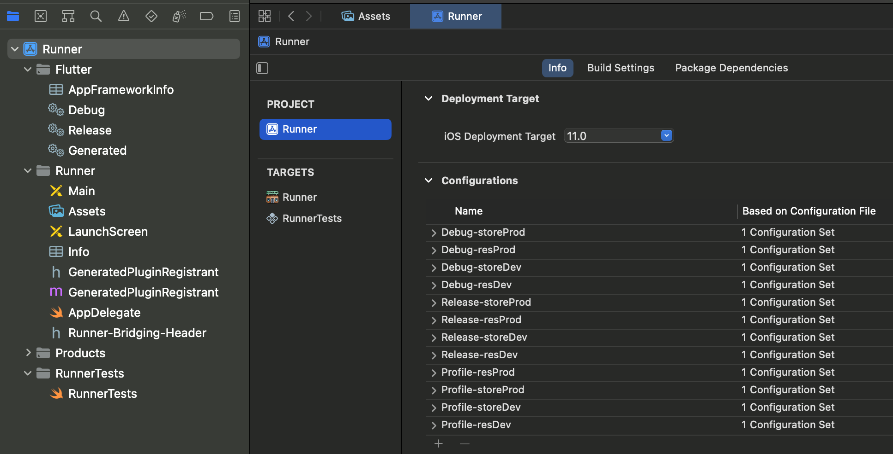
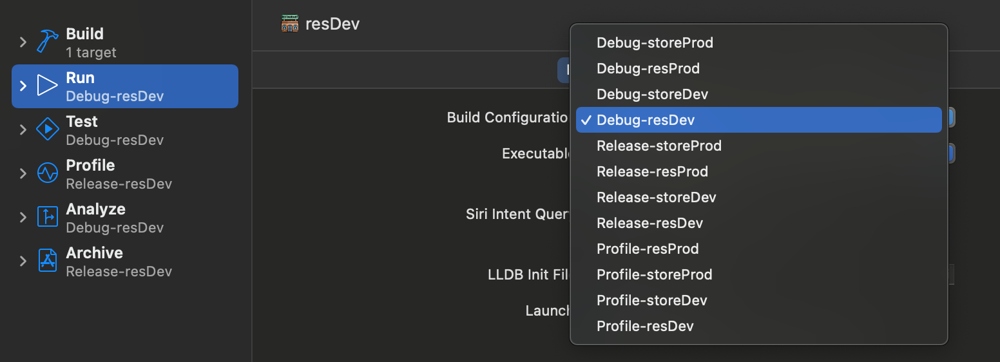

# flutter_favors_practice

## Introduction

This Flutter project was made by Huy Ho (HuyHo3820) with a purpose to give a tutorial about multiple configurations of separated environments like dev, stg, and prod using one code base which are the terminologies "Flavors" in Android and "Custom Schemes" in IOS.

## Getting Started

### What are flavors?

Flavors in Flutter (known as build configurations in iOS and Flavors in Android), allow the developer to create separate environments for your app using the same code base.

Assuming that you want to make both free and paid versions of your Flutter app. You can use flavors to set up both app versions without writing two separate apps, for example, you might have one flavor for your full-fledged production app, another as a limited “free” app, another for testing experimental features, and so on.

You also might use flavors for feature development. If you’ve built a new feature and want to try it out, you could set up a flavor to test it out. Your production code remains unaffected until you’re ready to deploy your new feature.

Flavors let you define compile-time configurations and set parameters that are read at runtime to customize your app’s behavior.

### Android Configuration of Flavors

In Android, Flavors configuration is mainly conducted in folder **your_project/android/app**. So you will work around the area of this folder.

#### Step 1: Define flavorDimensions and productFlavors

Go to **android/app/build.gradle** file, find the **android {}** section. Inside this section, you define **flavorDimensions** and **productFlavors** like the following:

In this example, I define only one **flavorDimensions "app"**. In real-life situation, you can define multiple values of **flavorDimensions** up to your purpose.

As regards **productFlavors**, this is where I define my custom environments (flavors). In this example, I define two apps (restaurant, store) in which have two environments (dev, prod) for each app. As you can see, finally I defined 4 flavors.

Notice that each flavor follows a specific dimension. If you set multiple **flavorDimensions**, be careful when assign dimension in each flavor

For more information, please discover this:
[Using flavors in Android](https://docs.flutter.dev/deployment/flavors#using-flavors-in-android)

#### Step 2: Create a folder and set up configuration for each flavor.

In **android/app/src** folder, you create a folder and set up configuration for each flavor. In this example, I have 4 flavors so I created 4 folders.

Each folder contains some configuration for each environment like app label, app icon, etc.

Create **strings.xml** in **res/values** sub folder and set **app_name** variable which represents for app label in each environment.

#### Step 3: Configure dynamic app name (label)

Add the **android:label** property with value of **@string/app_name** in **android/app/main/AndroidManifest.xml** file

### iOS Configuration of Scheme

Remember: **Flavors** in **Android** and **Flutter** are **Schemes** for **IOS**

#### Scheme Configuration and Management

To configure Scheme Flavor for iOS, you need to open **XCode**.

Next, you need to configure 2 environments (dev, prod) for 2 apps (store, restaurant) flavors so you will add new 4 schemes.

To Add New Scheme, click on the **Runner** box, click on **New Scheme**, and name your scheme. ex: resDev, resProd, storeDev, storeProd

Next, you have to set up all the build configurations for each defined flavor.

Select the **Runner** on the top and then choose the **Runner project** and move to the **Info** part. Here you will see different configurations. By default, the project only has 3 Configurations (Debug, Release, Profile).

Until now, you have defined 4 flavors (resDev, resProd, storeDev, storeProd) so you need to duplicate the **Debug/Release/Profile** configurations for all flavors.

To do that, you click on **plus** button in **Configurations section** and choose to duplicate **Debug/Release/Profile** configuration for specific flavor.

Now assuming that you have set up all the build configurations that would lead to that you can run your project with multiple **Schemes (Flavors)**. But we still connect to the default runner, so what we have to do is to **edit the scheme** by clicking on **Runner** and choose **Edit Scheme**.

Here inside we have to change **Build Configuration** of all the different targets/environments to a suitable configuration. We respectively do this editing scheme implementation for our defined schemes.

Next, you switch to **Runner Target**, click on **Build Settings** tab, and search **Product Bundle Identifier**, open it we can see each bundle identifier of Schemes, if we want to publish our app to app store, it would receive a unique bundle identifier

What we need to do is add a prefix to each bundle identifier to make it unique

#### Change the name of the application based on each Scheme (Flavor)

You have to go inside Info.plist file. Find **Bundle display name property**, if it doesn't exist, you add a new parameter Bundle display name and pass the value of a pointer to **APP_DISPLAY_NAME**

Next, you will go to **Runner Tagets**, click on **Build Settings**, select **All** option, and find **User-Defined section**

Press on **plus (+) button** to **Add User-Defined Setting**, and you will set the variable with the name **“APP_DISPLAY_NAME”**. Here you have the possibility to set it for all the different schemes you have defined.

#### Setup iOS App Icon for Schemes

You can use **App Icon** generator plugin in flutter [flutter_launcher_icons](https://pub.dev/packages/flutter_launcher_icons) to generate app icon for Android & IOS. It works fine in Android, but in IOS you need to do some configurations to apply App Icon for each Scheme.

You go to XCode, In Runner Targets, you switch to **Build Settings** tab and find **Primary App Icon Set Name** in **Asset Catalog Compiler** section. By default, you can see that all of them have been set to a specific path.

Make sure that your application icons are added to the **Assets.xcassets** like this.

Let’s head over back to Asset Catalog Compiler and change the path to a suitable app icon path for each scheme.

### Set up build configuration in VSCode

Go to **.vscode/launch.json** file, if it doesn't exist, create one. In **.vscode/launch.json** file, you need to define configurations for running the project in a specific version.

### Final Result

Run project with each environment. Finally, you will have 4 apps using 1 code base.

